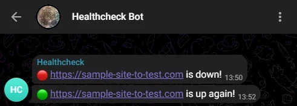

# Healtcheck Bot (Telegram)

A simple telegram bot for monitoring the health of websites and sending notifications if any went down or up.



## Features

-   Monitors multiple websites at regular intervals.
-   Send notifications to telegram chat if any website went down or up.
-   Sends a regular self-check message to the chat.
-   /health endpoint for health checking the health checker.

## Configuration

Getting telegram bot parameters:

-   Create a telegram bot using the [BotFather](https://core.telegram.org/bots#botfather).
-   Get the chat id of the chat where you want to receive notifications.
-   Set following environment variables:
    -   `BOT_TOKEN`
    -   `CHAT_ID`

Settings via environment variables:

```env
# Comma-separated list of sites to check
SITES=https://github.com,https://telegram.org
# Interval in minutes for checking if sites went down.
INTERVAL=30
# Interval in minutes for checking if sites known to be down are up again.
NERVOUS_INTERVAL=1
# Cron: Every monday at 09:00
CRON_ALIVE_SELF=0 9 * * 1
# If set to true, a site is not considered down if we get a 3xx, 4xx, or 5xx status code.
STRICT_DOWN_CHECK=false
# Healthcheck Endpoint
HEALTHCHECK_ENDPOINT=/health
HEALTHCHECK_ENDPOINT_ENABLED=true
PORT=80
# Bot settings
BOT_TOKEN=XXXXXXXXXXXXXXXXXXXXXXXXXXXXXX
CHAT_ID=XXXXXXXXXXXXX
# Templates for messages
TEMPLATE_DOWN=🔴 {site} is down!
TEMPLATE_UP=🟢 {site} is up again!
TEMPLATE_ALIVE_SELF=🔵 I'm alive and well!
```

## Usage

Configure as described above, run `npm install` and `npm start`. No external services are required, so you can simply deploy it to [render.com](https://render.com), [heroku](https://heroku.com) or any other platform that supports node.js (express) apps.
